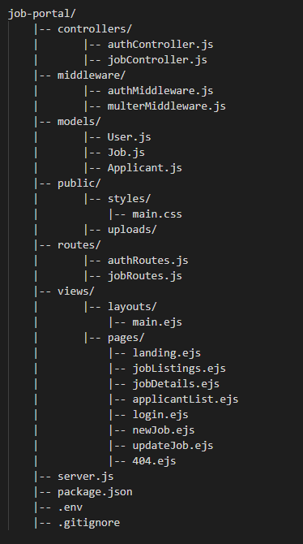

# Job-Portal
 html5, css3, javascript, NodeJs, ExpressJS

# Goal
Develop a job portal website that allows recruiters to post and manage job listings and provides a user-friendly platform for job seekers to find and apply for suitable roles.

# Structure
Project structure follow a modular MVC (Model-View-Controller) pattern. Below is a textual representation of the structure:

# Steps
Follow the following steps to build the project.

1. Set up an Express.js application and its related configurations.

2. Install necessary project dependencies based on the functionalities required.

3. Configure EJS as the templating engine and create views for job seekers to browse all jobs, view details of a job, apply to jobs, and recruiters to create, update, delete, and view their job postings.

4. Create a User model with functions for getting all the users, adding a user, and confirming user login.

5. Create a User controller to interface with the User model and handle user registration, login, and logout.

6. Create a Job model with functions for creating a new job, retrieving all jobs, finding a job by its id, updating a job, adding a new applicant to a job, retrieving all applicants for a job, and deleting a job.

7. Create a Job controller to interface with the Job model to create, update and delete jobs, and to manage job applicants.

8. Implement routes for user registration, login, logout, job operations including creating, updating, and deleting job postings, and to fetch necessary views.

9. Implement a session based user authentication and management system for recruiters.

10. Set up middleware to handle resume uploads using Multer, send confirmation emails after applying for a job using Nodemailer, and to track a user's last visit using cookies.

11. Document the application explaining functionalities, dependencies, and code organization for easy understanding of the codebase.

# Additional Functionality

1. Implement job search functionality to allow users to filter jobs with the search input in the navbar.

2. Redirect Recruiters to the all jobs page if they are already logged in instead of showing login/register options.

3. Implement resource-based authorization so that only the recruiter who posted a job can update or delete it.

4. Display the user's last visit date and time on the frontend to provide personalized information.

5. Add confirmation dialogs for update and delete operations to prevent accidental modifications.

5. Add confirmation dialogs for update and delete operations to prevent accidental modifications.

6. Implement a common validation middleware for consistent form validation across the application.

7. Implement pagination for job listings and applicant lists to improve performance.

# Component Structure

1. Layouts Page: A common layout view that includes the header, main content, and footer.

2. Landing Page: Showcases a welcome message and provides a brief overview of the job portal.

3. Job Listings Page: Displays all available job postings.

4. Job Details Page: Shows detailed information about a specific job.

5. Applicant List Page: Displays a list of applicants for a specific job.

6. Login Page: Allows recruiters to log in to their accounts.

7. New Job Page: Form for recruiters to create a new job posting.

8. Update Job Page: Form for recruiters to update an existing job posting.

9. 404 Page: Displayed when a requested page is not accessible.

# Data Structures

## User

- id: Unique identifier for each user.

- name: Name of the user.

- email: Email address of the user.

- password: Password for user authentication.

## Job

- id: Unique identifier for each job.

- jobcategory: Category or type of the job.

- jobdesignation: Designation of the job.

- joblocation: Location of the job.

- companyname: Name of the company offering the job.

- salary: Salary range for the job.

- applyby: Application deadline for the job.

- skillsrequired: Array of required skills for the job.

- numberofopenings: Number of available openings for the job.

- jobposted: Date and time when the job was posted.

- applicants: Array of applicants who have applied for the job, each with their own attributes

## Applicant

- applicantid: Unique identifier for each applicant.

- name: Name of the applicant.

- email: Email address of the applicant.

- contact: Contact number of the applicant.

- resumePath: Path to the applicant's resume file

# API Structure

## Auth routes

- POST /register: Register a new recruiter account

- GET /: Render the login page

- POST/login: Log in as a recruiter

- POST/logout: Log out the currently logged-in recruiter

## Job routes

1. /jobs

- GET /: Retrieve all job listings

- POST/ Create a new job listing

- GET /:id: Retrieve a specific job listing by ID

- PUT /:id: Update a specific job listing by ID

- DELETE/:id: Delete a specific job listing by ID

2. /jobs/:id/applicants

- GET /: Retrieve all applicants for a specific job listing

- POST/: Add a new applicant to a specific job listing

- GET /:applicantld: Retrieve a specific applicant by ID for a job listing

- PUT/:applicantld: Update a specific applicant

- DELETE/:applicantld: delete a specific applicant by Id for a job listing

3. /jobs/:id/update

- GET /: Render the update form for a specific job listing

- POST/: Update a specific job listing by ID

4. /jobs/:id/delete

- GET /: Delete a specific job listing by ID

5. /apply/:id

- POST/: Apply to a specific job listing by ID. uploading a resume

6. /404

- GET /: Render the 404 error page